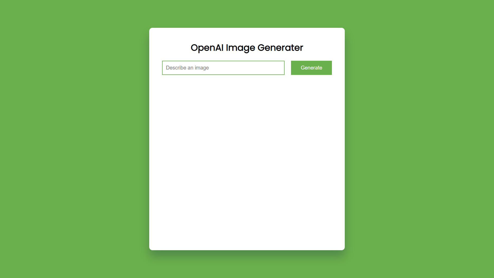

# JavaScript (Node JS, Express JS) & Open AI Image Generator

This application is built using Node JS, Express JS and Open AI API. This application generate images through OpenAI Dall-E models based on user inputs.



## Usage

Create the .env file in the root folder and Generate your API KEY from [OpenAI](https://beta.openai.com/) and add it to the `.env` file.

Install the dependencies

```bash
npm install
```

Run server using Node

```bash
npm start
```

Run server using Nodemon

```bash
npm run dev
```

Visit `http://localhost:8000` in your browser.
